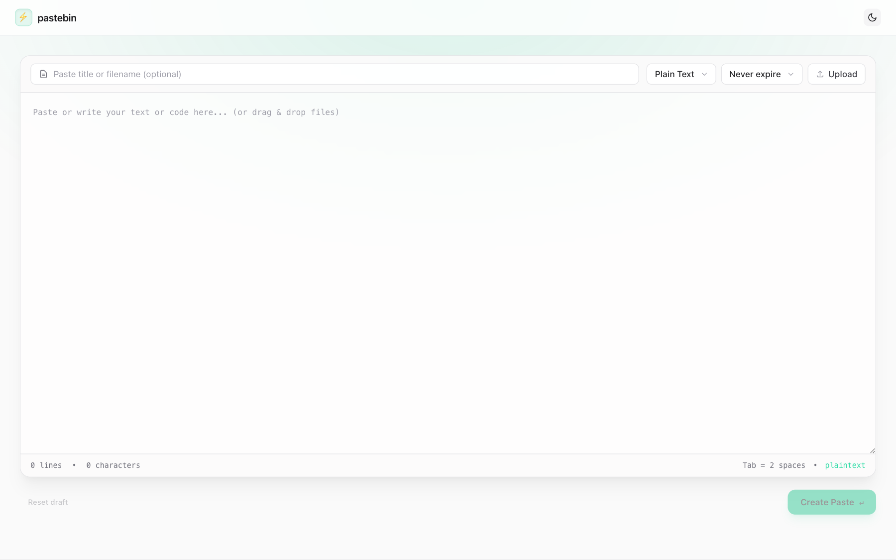
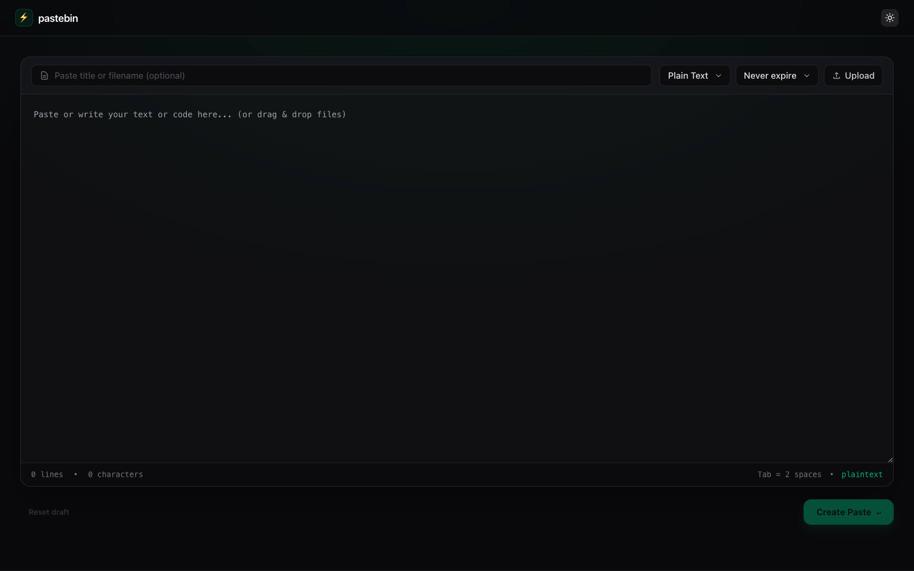
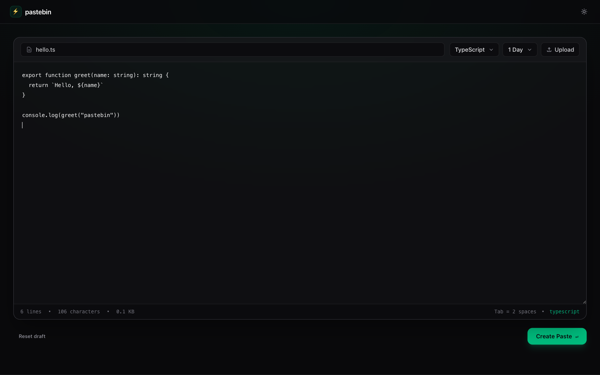
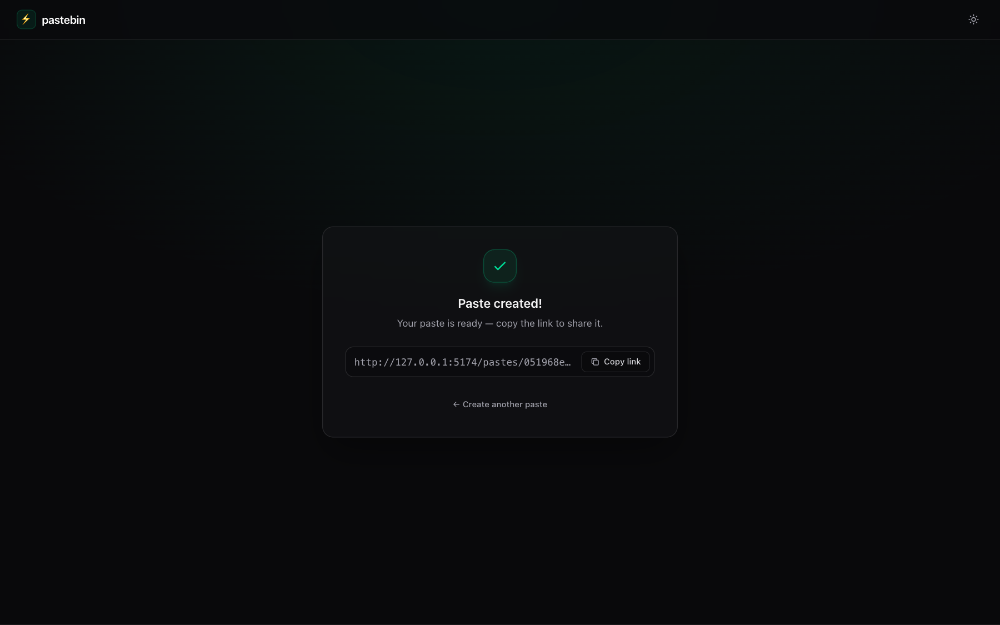
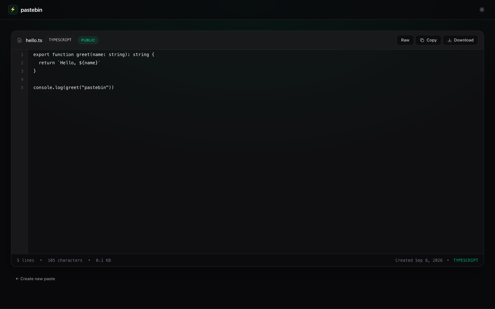
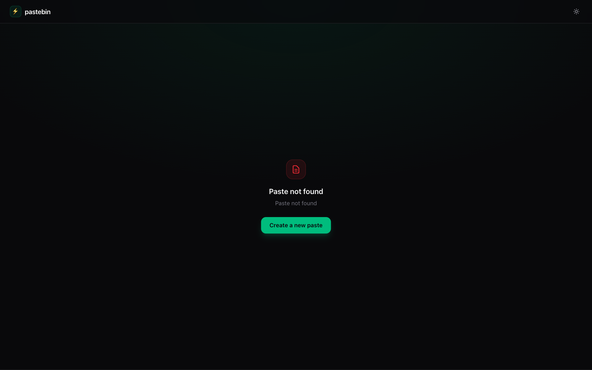

# pastebin

Create a paste, get a share link, view it. Optional expiry, burn-after-read, and file attachments.

```
user-web  (:5173)  -- /api proxy -->  pastebin-service  (:9000)
                                           |
                                    PostgreSQL  (:5432)
                                    Redis       (:6379)
                                    local disk  or  MinIO/S3
```

| Piece | Stack |
|---|---|
| **pastebin-service** | Java 25, Spring Boot 4, JPA, Flyway, Spring Security, hexagonal (ports & adapters) |
| **user-web** | React 19, Vite, TypeScript, Tailwind 4, Zustand, Ky |
| **infra** | PostgreSQL 17, Redis 7, optional MinIO |

---

## Screenshots

### Create paste

Light and dark. Title, syntax, expiry, drag-and-drop upload, `⌘/Ctrl+Enter` to submit.







### Share link

After create: copyable URL, no redirect.



### View paste

Line numbers, raw/copy/download, syntax + privacy badges.





---

## Project structure

```
pastebin/
├── docker/
│   └── docker-compose.yml          # postgres + redis + minio
├── docs/screenshots/
├── pastebin-service/               # API
└── user-web/                       # SPA
```

### pastebin-service

Hexagonal: `adapter` talks to the world, `application` is use cases, `domain` has no framework.

```
pastebin-service/
├── build.gradle.kts
├── run.sh                          # postgres (docker) + bootRun
├── src/main/java/dev/hieplp/pastebin/
│   ├── PastebinApplication.java
│   ├── adapter/
│   │   ├── in/
│   │   │   ├── web/                # REST, security, payloads, OpenAPI
│   │   │   │   ├── controller/     # PasteController, PasteFileController
│   │   │   │   ├── config/         # SecurityConfig
│   │   │   │   └── payload/
│   │   │   └── schedule/           # expired pastes + orphan files
│   │   └── out/
│   │       ├── persistence/        # JPA entities, repos, mappers
│   │       ├── localstorage/       # disk under uploads/
│   │       └── s3/                 # S3 / MinIO
│   ├── application/
│   │   ├── port/{in,out}/          # use-case + persistence/storage ports
│   │   ├── service/{paste,file}/
│   │   └── dto/
│   └── domain/                     # Paste, VOs, Syntax/Privacy/PasteStatus
├── src/main/resources/
│   ├── application.yaml            # :9000, local storage default
│   └── db/migration/V1__init.sql
└── src/test/java/...
```

### user-web

```
user-web/
├── package.json
├── vite.config.ts                  # /api → http://localhost:9000
├── index.html
├── public/
└── src/
    ├── api/                        # Ky client, pastes + files
    ├── components/
    │   ├── layout/                 # AppLayout, Navbar
    │   ├── ui/                     # Input, Select, ThemeToggle, Copy/Download
    │   └── icons/
    ├── hooks/                      # upload, drag-drop, clipboard, shortcuts
    ├── lib/router.ts               # history-backed SPA router
    ├── pages/
    │   ├── CreatePastePage/
    │   └── DetailPastePage/        # /pastes/:id and /p/:id
    ├── stores/                     # paste, theme, alert (zustand)
    ├── types/
    └── utils/
```

---

## Run

Postgres on `:5432`, Redis on `:6379`. MinIO only if you switch storage to S3.

```bash
# database (+ minio)
docker compose -f docker/docker-compose.yml up -d

# API  →  http://localhost:9000
# OpenAPI: /swagger-ui  or  /scalar
cd pastebin-service && ./run.sh

# web  →  http://localhost:5173  (proxies /api → :9000)
cd user-web && bun install && bun run dev
```

`run.sh` starts a `pastebin-postgres` container if one is missing, and moves the app to `:8081` if `:8080` is taken. The app itself listens on **9000** (`application.yaml`).

### Storage

| `PASTEBIN_STORAGE_TYPE` | Where files go |
|---|---|
| `local` (default) | `pastebin-service/uploads/` |
| `s3` | MinIO at `http://127.0.0.1:9002`, bucket `pastebin` |

```bash
export PASTEBIN_STORAGE_TYPE=s3
cd pastebin-service && ./run.sh
```

---

## API

JSON envelope: `{ "code", "message", "data" }`. Create is multipart.

| Method | Path | |
|---|---|---|
| `POST` | `/pastes` | `request` JSON part + optional `files` |
| `GET` | `/pastes/{idOrAlias}` | lookup by id or alias; burn-after-read deactivates on first read |
| `GET` | `/files/{fileId}` | metadata |
| `GET` | `/files/{fileId}/download` | bytes |

Create body (`request` part):

```json
{
  "title": "hello.ts",
  "content": "export function greet() {}",
  "syntax": "TYPESCRIPT",
  "privacy": "PUBLIC",
  "alias": "hello",
  "expiredAt": "2026-09-09T00:00:00Z",
  "burnAfterRead": false
}
```

Syntax: `PLAINTEXT` `JAVASCRIPT` `TYPESCRIPT` `PYTHON` `JSON` `HTML` `CSS` `MARKDOWN` `SQL` `RUST` `GO` `BASH`.

Expiry in the UI: never, 10 minutes, 1 hour, 1 day, 1 week, or burn after read. Cleanup cron: expired pastes hourly, orphan files weekly.

Web routes: `/` create, `/pastes/:id` and `/p/:id` view.
